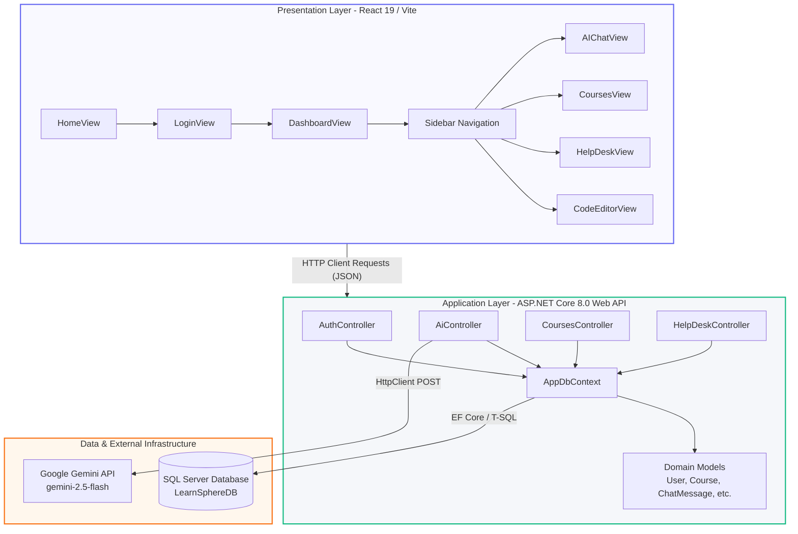
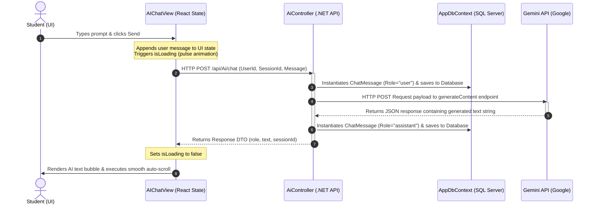

# LearnSphereAI (ByteForce Prototype)

LearnSphereAI is an AI-powered, curriculum-aligned academic learning platform designed to streamline student course management and provide targeted educational assistance. The application features an interactive AI assistant that responds directly within the context of university learning paths, paired with a live coding playground, leaderboard gamification, and a direct support desk system.

---

## 🏗️ System Architecture :




## End-to-End AI Chat Sequence Diagram




## Tech Stack

The workspace is split into two major layers:

### Backend (`/Backend/LearnSphereAI.Api`)
*   **Framework:** ASP.NET Core 8.0 Web API
*   **Database ORM:** Entity Framework (EF) Core with SQL Server (MS SQL Express)
*   **AI Integration:** Google Gemini API (`Google.GenAI` SDK)
*   **Security:** BCrypt password processing capabilities alongside planned JWT authentication middleware

### Frontend (`/Frontend/ai-learning-assistant`)
*   **Framework:** React 19 (via Vite)
*   **Styling:** Tailwind CSS (v4) with dark mode default processing
*   **Icons:** Lucide React
*   **Authentication Hooks:** Google OAuth capabilities (`@react-oauth/google`)

---

## 📂 Visual Directory Map

```text
mani-741-byteforce-prototype/
├── Backend/
│   └── LearnSphereAI.Api/
│       ├── Controllers/       # API Endpoints (Ai, Auth, Courses, HelpDesk)
│       ├── Data/              # EF DbContext instantiation
│       ├── Migrations/        # SQL Server schema migration tracking
│       └── Models/            # Database domain entities (User, Course, ChatMessage, etc.)
└── Frontend/
    └── ai-learning-assistant/
        ├── src/
        │   ├── App.jsx        # App Core Container (Views, states, and client logic)
        │   ├── main.jsx       # Virtual DOM entry point
        │   └── index.css      # Tailwind styling injections
        ├── vite.config.js     # Dev tooling configuration
        └── package.json       # System module manifest
```
---


## ⚡ Quick Start & Installation


**Prerequisites**

```
.NET 8.0 SDK

Node.js (v18 or higher)

SQL Server Express (SSMS)
```

**1. Database Setup & Migrations**
Open your local SQL Server instance and ensure the target engine is active (LTIN691781\SQLEXPRESS).

Navigate to the backend directory:

```
cd Backend/LearnSphereAI.Api


3. Update your connection strings inside `appsettings.json` and `appsettings.Development.json` if your local SQL Server instance name differs.
4. Execute database initialization scripts via the .NET Core CLI tool to update your local server instance to the snapshot state:

   dotnet ef database update

```
   
**2. Run the Backend API**
```
From the /Backend/LearnSphereAI.Api path, trigger execution:


dotnet run --launch-profile https
API Base Endpoint: https://localhost:5000 or http://localhost:5001

Interactive Testing: Append /swagger to the runtime URL in your browser to interact with endpoints directly.

```

**3. Frontend Configurations & Key Assignments**

```
Move to the frontend React layer:


cd Frontend/ai-learning-assistant

Install the necessary packages:


npm install

```
---

*   **Application UI Endpoint:** `http://localhost:5173`

---

## 🧩 Key API Endpoint Breakdown

| Area | Controller | Route | Method | Description |
| :--- | :--- | :--- | :--- | :--- |
| **Authentication** | `AuthController` | `/api/Auth/register` | `POST` | Registers new student credential map to database. |
| | | `/api/Auth/login` | `POST` | Processes logins against local database state. |
| **Courses Engine** | `CoursesController` | `/api/Courses` | `GET` | Pulls the absolute universe of mapped catalog records. |
| | | `/api/Courses/enroll` | `POST` | Links a given `UserId` to a specific `CourseId`. |
| | | `/api/Courses/progress`| `POST` | Advances the percentage metrics on curriculum tracks. |
| **AI Processing** | `AiController` | `/api/Ai/chat` | `POST` | Maps queries directly to Gemini with state tracking. |
| | | `/api/Ai/sessions/{id}`| `GET` | Fetches distinct chat historical maps for sidebars. |
| **Support Desk** | `HelpDeskController` | `/api/HelpDesk/submit`| `POST` | Files technical or syllabus reports to administrators. |

---

## 🛡️ Important Security Note
> [!WARNING]  
> The current system profile contains an exposed development API key for the Google Gemini integration within `appsettings.Development.json`. For production releases, immediately revoke this credential and shift processing to a secure system environment variable map (`Environment.GetEnvironmentVariable("GeminiApiKey")`) or use a secure secrets manager. Ensure passwords processing transitions to automated hashing algorithms rather than plaintext assignments during development database testing.

